# Gut Microbiome Profiling in Pediatric Ulcerative Colitis
Davide Maccarrone

# Executive summary

**Objective.** To characterize the gut microbiome of children with
ulcerative colitis (UC) compared with healthy children, using a
reproducible end-to-end 16S rRNA workflow on the public dataset
PRJNA759642.

**Dataset.** 42 fecal samples (19 UC, 23 healthy; age 7–21 years), 16S
rRNA V4 amplicons, Illumina MiSeq 2 × 150 bp.

**Main findings.**

-   *Data quality and processing:* after DADA2 processing and chimera
    removal, the median number of non-chimeric reads per sample was
    **73,465**, and **73.4%** of all input reads were retained overall.
-   *Within-sample diversity:* Shannon diversity was **lower in UC**
    than in Healthy samples (median Shannon index: 2.44 vs 2.69;
    Wilcoxon p = **0.002**). After adjustment for age and gender,
    Shannon diversity in UC was **0.80-fold** that of Healthy samples
    (95% CI: **0.71–0.90**). The group difference remained significant
    at every rarefaction depth tested (1,000–100,000 reads; Wilcoxon p =
    **0.002**) and after adjustment for library size.
-   *Between-sample diversity:* disease status explained **9.7%** of
    Bray-Curtis variation (PERMANOVA *p* = **0.001**); dispersion did
    not differ significantly between groups (*p* = **0.329**).
-   *Differential abundance:* **28 taxonomic features** (22 named
    families, one of them archaeal, and 6 unclassified lineages)
    differed between groups at BH-FDR \< 0.25 (**12 enriched** and **16
    depleted** in UC), including **Enterobacteriaceae, Morganellaceae
    and Neisseriaceae** (enriched) and **Methanobacteriaceae and
    Barnesiellaceae** (depleted).

**Take-home message.** UC was associated with reduced within-sample
diversity and a distinct community composition compared with healthy
children, with a differential-abundance profile marked by an expansion
of Enterobacteriaceae-related taxa. Given the small cohort, the
exploratory significance threshold and the lack of adjustment for
treatment, these findings are associations to be validated in larger
cohorts.

# Background and objectives

Ulcerative colitis is a form of inflammatory bowel disease characterized
by inflammation and ulceration of the colon. Gut microbial dysbiosis has
been reported in both children and adults with UC. This report
reproduces and extends, with a fully scripted workflow, the 16S rRNA
analysis of the pediatric cohort published by Zuo et al. (2022).

The analysis addresses four questions:

1.  Is the sequencing data of sufficient quality, and how many reads and
    variants are retained after processing?
2.  How is the gut microbial community composed at the phylum level?
3.  Do within-sample (alpha) and between-sample (beta) diversity differ
    between UC and healthy children, after accounting for age and
    gender?
4.  Which microbial families differ in abundance between the two groups?

# Dataset

<table>
<colgroup>
<col style="width: 37%" />
<col style="width: 62%" />
</colgroup>
<thead>
<tr>
<th style="text-align: left;">Feature</th>
<th style="text-align: left;">Description</th>
</tr>
</thead>
<tbody>
<tr>
<td style="text-align: left;">Source</td>
<td style="text-align: left;">NCBI SRA, BioProject PRJNA759642 (Zuo et
al., 2022)</td>
</tr>
<tr>
<td style="text-align: left;">Sample type</td>
<td style="text-align: left;">Fecal samples, pediatric cohort</td>
</tr>
<tr>
<td style="text-align: left;">Samples analyzed</td>
<td style="text-align: left;">42 (main cohort selected from the 114 runs
of the BioProject)</td>
</tr>
<tr>
<td style="text-align: left;">Groups</td>
<td style="text-align: left;">Healthy (n = 23), UC (n = 19)</td>
</tr>
<tr>
<td style="text-align: left;">Age</td>
<td style="text-align: left;">Healthy: median 14 (range 8–21) years; UC:
median 15 (range 7–20) years</td>
</tr>
<tr>
<td style="text-align: left;">Gender</td>
<td style="text-align: left;">Healthy: 13 female / 10 male; UC: 9 female
/ 10 male</td>
</tr>
<tr>
<td style="text-align: left;">Sequencing</td>
<td style="text-align: left;">Illumina MiSeq, paired-end 2 × 150 bp, 16S
rRNA V4 region (515F/806R)</td>
</tr>
</tbody>
</table>

# Methods

## Raw-read quality control

Raw reads were assessed with FastQC and summarized with MultiQC.
Aggregate quality profiles were additionally inspected in DADA2 to set
the truncation lengths. Primers had already been removed by the data
submitters before SRA deposition, and no adapter or primer contamination
was detected.

## ASV inference and taxonomy

Reads were processed with DADA2: filtering and trimming (truncation at
140 bp for forward and 130 bp for reverse reads, maximum 2 expected
errors per read, no ambiguous bases, PhiX removal), separate error-rate
learning for forward and reverse reads, independent per-sample
denoising, paired-end merging, and removal of chimeras with the
consensus method. Taxonomy was assigned with the DADA2 naive Bayesian
classifier trained on SILVA 138.2 (non-redundant 99% set), followed by
species-level assignment by exact matching.

## Community analysis

ASVs, taxonomy and metadata were integrated in a phyloseq object.
Analyses were performed at three taxonomic levels: phylum (composition),
genus (alpha and beta diversity) and family (differential abundance).
ASVs were aggregated with `tax_glom` on the unfiltered table. ASVs
without an annotation at the chosen rank were retained as separate
“unclassified” units, one for each distinct higher-rank lineage, and are
labelled with their lowest assigned rank.

**Alpha diversity.** The Shannon index was calculated on genus-level
counts and compared between groups with the Wilcoxon rank-sum test. The
effect of disease status was then estimated with a linear model on
log-transformed Shannon diversity, adjusted for age and gender.
Sequencing-depth effects were evaluated with Spearman correlations
(library size vs Shannon and vs observed genera), by adding log10
library size to the model, and with a rarefaction sensitivity analysis
at 1,000, 5,000, 10,000, 30,000, 50,000 and 100,000 reads. At each
depth, the Shannon index was computed on each of 100 rarefied tables and
averaged per sample; samples with fewer reads than the target depth were
retained with all their reads.

**Beta diversity.** Bray-Curtis dissimilarities were computed on
genus-level relative abundances and visualized with PCoA. Group
differences were tested with PERMANOVA (`vegan::adonis2`, marginal
effects of disease status, age and gender, 999 permutations) and
homogeneity of dispersion with `betadisper` and `permutest` (999
permutations). Multiple Regression on distance Matrices (`ecodist::MRM`,
999 permutations) was used to model pairwise dissimilarities as a
function of the disease-status combination of each sample pair
(Healthy–UC and UC–UC, with Healthy–Healthy as reference), the gender
combination (Female–Male and Female–Female, with Male–Male as reference)
and the age difference.

**Differential abundance.** Family-level counts were filtered (families
with zero counts in at least 90% of samples, or with variance below half
of the median variance, were removed), normalized with TMM, and tested
for UC vs Healthy with the edgeR exact test after estimating
negative-binomial dispersions. P-values were adjusted with the
Benjamini–Hochberg procedure and taxa with FDR \< 0.25 were considered
significant. This permissive threshold was adopted because of the small
sample size and the exploratory aim of the analysis; the taxa that also
passed FDR \< 0.05 are reported separately.

All permutation procedures used a fixed seed (1234). The analysis was
run in R (v4.6.0); package versions are recorded in `renv.lock` and in
the session-information files saved by each script.

# Results

## Sequencing quality

Raw read counts per sample ranged from **22,274 to 1,592,901 (median
107,241)**. Base quality was generally high along the reads, with
localized fluctuations and a drop in the last cycles, and no adapter
contamination was observed
(<a href="#fig-qc-fw" class="quarto-xref">Figure 1</a>,
<a href="#fig-qc-rv" class="quarto-xref">Figure 2</a>). In the reverse
reads, the proportion of reads reaching each cycle (red line) begins to
decline at about cycle 140. Modules flagged as warnings or failures by
FastQC (per-base sequence content, duplication levels, overrepresented
sequences, GC content) are expected for amplicon data, in which all
reads derive from the same short, low-diversity locus, and do not
indicate technical problems.

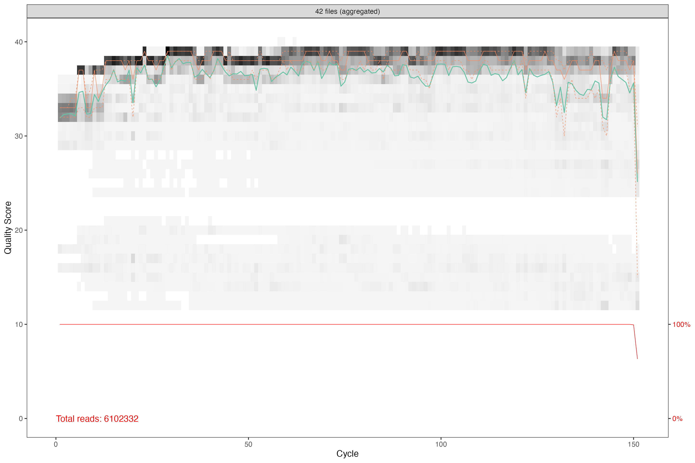

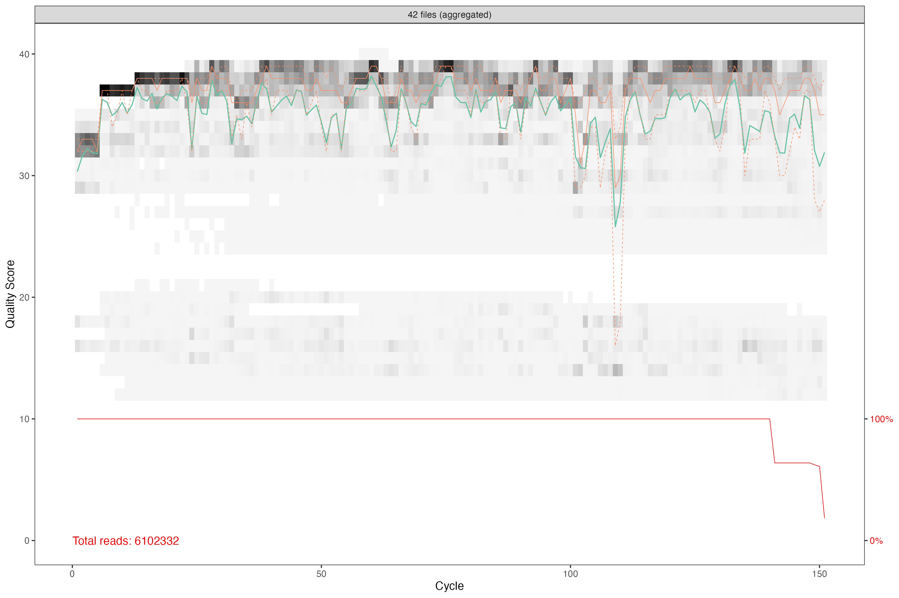

## ASV inference

Truncation lengths (140 bp forward, 130 bp reverse) were set on the
aggregate quality profiles to exclude the final cycles, where quality
drops and, in the reverse reads, part of the reads end, while leaving
enough overlap to merge the V4 amplicon. The learned error models
followed the observed error rates
(<a href="#fig-err-fw" class="quarto-xref">Figure 3</a>,
<a href="#fig-err-rv" class="quarto-xref">Figure 4</a>), and about 90%
of denoised reads were successfully merged (89.7%, ratio of medians;
<a href="#tbl-track" class="quarto-xref">Table 2</a>).

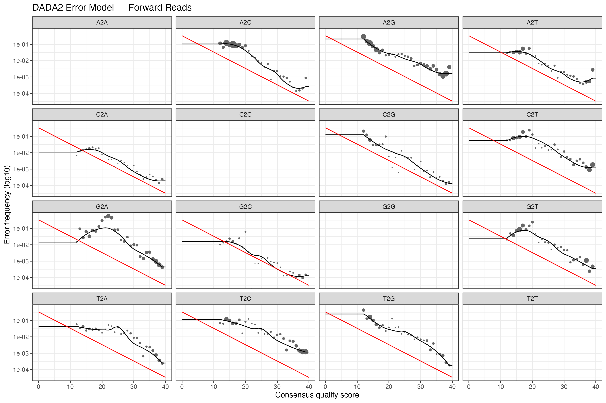

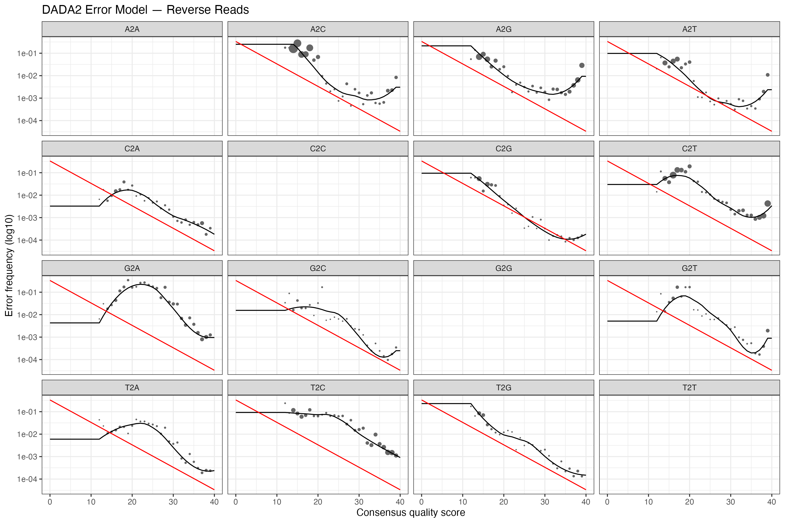

<a href="#tbl-track" class="quarto-xref">Table 2</a> summarizes how
reads were retained along the pipeline. In total, 3,564 non-chimeric
ASVs were obtained across 42 samples; 20.57% of merged reads were
identified as chimeric and removed, and overall 73.42% of all input
reads (summed across samples) were retained.

<table>
<colgroup>
<col style="width: 34%" />
<col style="width: 38%" />
<col style="width: 26%" />
</colgroup>
<thead>
<tr>
<th style="text-align: left;">Step</th>
<th style="text-align: left;">Median reads per sample (range)</th>
<th style="text-align: right;">Median reads, % of median input</th>
</tr>
</thead>
<tbody>
<tr>
<td style="text-align: left;">Input</td>
<td style="text-align: left;">107,241 (22,274–1,592,901)</td>
<td style="text-align: right;">100</td>
</tr>
<tr>
<td style="text-align: left;">Filtered</td>
<td style="text-align: left;">106,790 (22,274–1,577,430)</td>
<td style="text-align: right;">99.58</td>
</tr>
<tr>
<td style="text-align: left;">Denoised (forward / reverse)</td>
<td style="text-align: left;">105,622 / 105,414 (22,009–1,570,370 /
22,061–1,568,585)</td>
<td style="text-align: right;">98.49 / 98.30</td>
</tr>
<tr>
<td style="text-align: left;">Merged</td>
<td style="text-align: left;">94,729 (20,363–1,503,715)</td>
<td style="text-align: right;">88.33</td>
</tr>
<tr>
<td style="text-align: left;">Non-chimeric</td>
<td style="text-align: left;">73,465 (13,639–1,216,057)</td>
<td style="text-align: right;">68.50</td>
</tr>
</tbody>
</table>

## Taxonomic assignment and composition

Of the 3,564 ASVs, 99.4% were classified at phylum level, 90.6% at
family level, 67.8% at genus level and 7.2% at species level.

Sequencing depth after processing ranged from 13,639 to 1,216,057 reads
per sample (mean 106,668;
<a href="#fig-depth" class="quarto-xref">Figure 5</a>). ASV prevalence
was low for most variants (median prevalence: 1 sample out of 42;
<a href="#fig-prevalence" class="quarto-xref">Figure 6</a>), as is
typical of sparse microbiome tables.

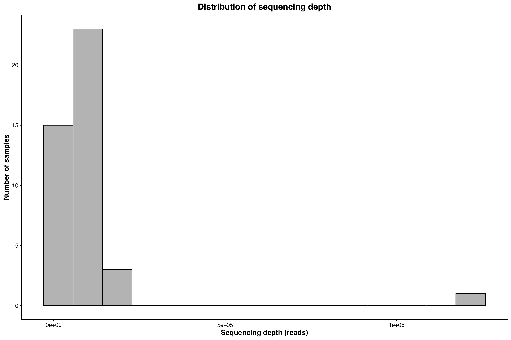

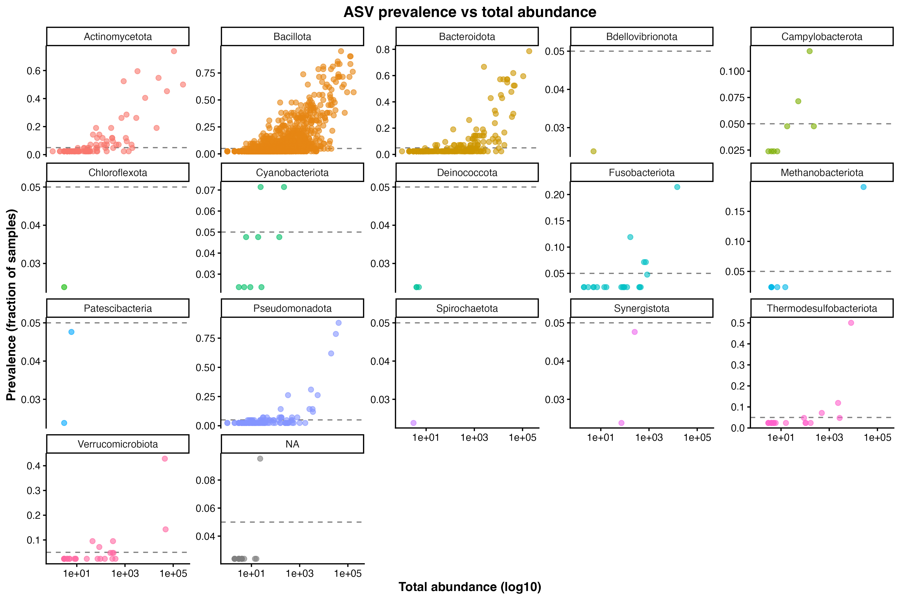

At phylum level the community was dominated by four phyla with mean
relative abundance ≥ 2%
(<a href="#fig-phylum" class="quarto-xref">Figure 7</a>,
<a href="#tbl-phyla" class="quarto-xref">Table 3</a>). Compared with
Healthy samples, UC samples showed a lower proportion of Bacillota
(52.2% vs 65.5%) and Actinomycetota (5.06% vs 9.21%), together with a
higher proportion of Bacteroidota (30.2% vs 20.2%) and Pseudomonadota
(9.49% vs 1.21%). These are descriptive means; group differences were
tested at family level (see Differential abundance).

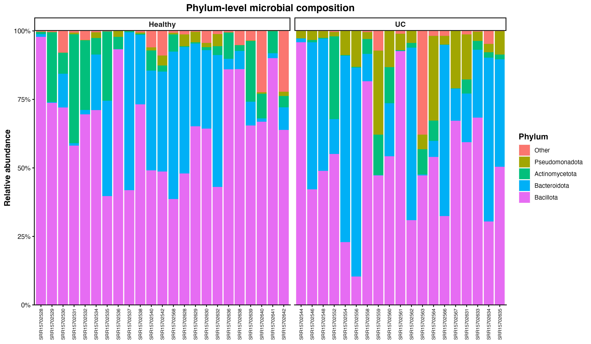

<table>
<colgroup>
<col style="width: 34%" />
<col style="width: 32%" />
<col style="width: 32%" />
</colgroup>
<thead>
<tr>
<th style="text-align: left;">Phylum</th>
<th style="text-align: right;">Healthy, mean relative abundance (%)</th>
<th style="text-align: right;">UC, mean relative abundance (%)</th>
</tr>
</thead>
<tbody>
<tr>
<td style="text-align: left;">Bacillota</td>
<td style="text-align: right;">65.5</td>
<td style="text-align: right;">52.2</td>
</tr>
<tr>
<td style="text-align: left;">Bacteroidota</td>
<td style="text-align: right;">20.2</td>
<td style="text-align: right;">30.2</td>
</tr>
<tr>
<td style="text-align: left;">Actinomycetota</td>
<td style="text-align: right;">9.21</td>
<td style="text-align: right;">5.06</td>
</tr>
<tr>
<td style="text-align: left;">Pseudomonadota</td>
<td style="text-align: right;">1.21</td>
<td style="text-align: right;">9.49</td>
</tr>
</tbody>
</table>

## Alpha diversity

Shannon diversity was lower in UC samples (median 2.442, IQR
2.031–2.686) than in healthy samples (median 2.693, IQR 2.564–3.044);
Wilcoxon p = 0.00205
(<a href="#fig-shannon" class="quarto-xref">Figure 8</a>).

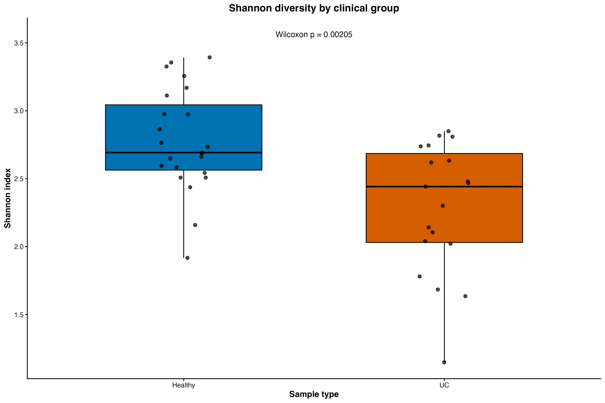

In the linear model adjusted for age and gender
(<a href="#tbl-lm" class="quarto-xref">Table 4</a>), UC was associated
with a 0.804-fold change in Shannon diversity relative to healthy
samples (95% CI 0.715–0.904; p = 0.000570). Age was not associated with
diversity (p = 0.653). Male gender showed a borderline, non-significant
association with higher diversity (fold change 1.12; p = 0.0519).

<table>
<colgroup>
<col style="width: 20%" />
<col style="width: 20%" />
<col style="width: 20%" />
<col style="width: 20%" />
<col style="width: 20%" />
</colgroup>
<thead>
<tr>
<th style="text-align: left;">Term</th>
<th style="text-align: right;">Estimate (log scale)</th>
<th style="text-align: right;">95% CI</th>
<th style="text-align: right;">Fold change</th>
<th style="text-align: right;">p-value</th>
</tr>
</thead>
<tbody>
<tr>
<td style="text-align: left;">UC vs Healthy</td>
<td style="text-align: right;">-0.2182</td>
<td style="text-align: right;">-0.336 to -0.101</td>
<td style="text-align: right;">0.804</td>
<td style="text-align: right;">0.000570</td>
</tr>
<tr>
<td style="text-align: left;">Age (per year)</td>
<td style="text-align: right;">-0.0038</td>
<td style="text-align: right;">-0.021 to 0.013</td>
<td style="text-align: right;">0.996</td>
<td style="text-align: right;">0.653</td>
</tr>
<tr>
<td style="text-align: left;">Gender (male vs female)</td>
<td style="text-align: right;">0.1159</td>
<td style="text-align: right;">-0.001 to 0.233</td>
<td style="text-align: right;">1.123</td>
<td style="text-align: right;">0.0519</td>
</tr>
</tbody>
</table>

### Robustness to sequencing depth

Library size was moderately correlated with Shannon diversity (Spearman
ρ = 0.425, p = 0.00499) and strongly correlated with the number of
observed genera (ρ = 0.734, p \< 0.001). When log10 library size was
added to the model, the UC effect was attenuated but remained
statistically significant (estimate = -0.181, p = 0.00984). Rarefaction
curves (<a href="#fig-rarecurve" class="quarto-xref">Figure 9</a>)
reached a plateau for most samples.

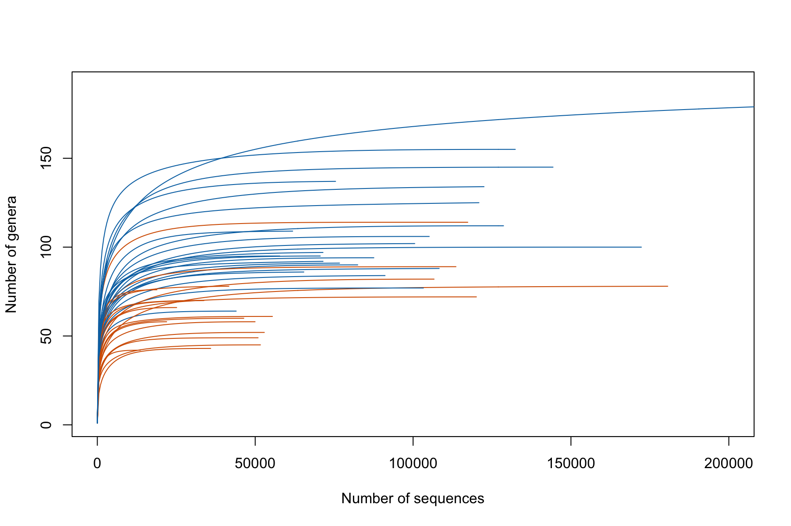

The group comparison was repeated after rarefaction at six depths
(<a href="#fig-rarefaction" class="quarto-xref">Figure 10</a>,
<a href="#tbl-rare" class="quarto-xref">Table 5</a>). Mean Shannon
diversity was slightly lower at 1,000 reads and stable from 5,000 reads
upward, and the difference between Healthy and UC was preserved at every
depth (Wilcoxon p = 0.00205 at all depths; the test depends only on the
ranking of samples, which did not change). All samples have at least
13,639 reads, so the comparisons at 1,000, 5,000 and 10,000 reads are
fully rarefied; at 30,000, 50,000 and 100,000 reads, 4, 11 and 26
samples fall below the target depth and are kept with all their reads,
so those panels are only partly rarefied.

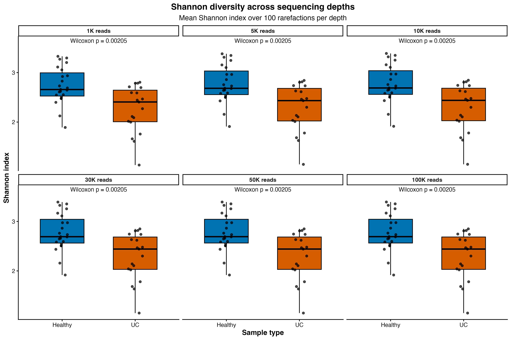

<table style="width:100%;">
<colgroup>
<col style="width: 20%" />
<col style="width: 54%" />
<col style="width: 24%" />
</colgroup>
<thead>
<tr>
<th style="text-align: right;">Depth (reads)</th>
<th style="text-align: right;">Samples below depth (retained in
full)</th>
<th style="text-align: right;">Wilcoxon p-value</th>
</tr>
</thead>
<tbody>
<tr>
<td style="text-align: right;">1,000</td>
<td style="text-align: right;">0</td>
<td style="text-align: right;">0.00205</td>
</tr>
<tr>
<td style="text-align: right;">5,000</td>
<td style="text-align: right;">0</td>
<td style="text-align: right;">0.00205</td>
</tr>
<tr>
<td style="text-align: right;">10,000</td>
<td style="text-align: right;">0</td>
<td style="text-align: right;">0.00205</td>
</tr>
<tr>
<td style="text-align: right;">30,000</td>
<td style="text-align: right;">4</td>
<td style="text-align: right;">0.00205</td>
</tr>
<tr>
<td style="text-align: right;">50,000</td>
<td style="text-align: right;">11</td>
<td style="text-align: right;">0.00205</td>
</tr>
<tr>
<td style="text-align: right;">100,000</td>
<td style="text-align: right;">26</td>
<td style="text-align: right;">0.00205</td>
</tr>
</tbody>
</table>

## Beta diversity

The first two PCoA axes of the genus-level Bray-Curtis distances
explained 30.3% and 13.1% of the variation
(<a href="#fig-pcoa" class="quarto-xref">Figure 11</a>). Samples partly
separated by clinical group.

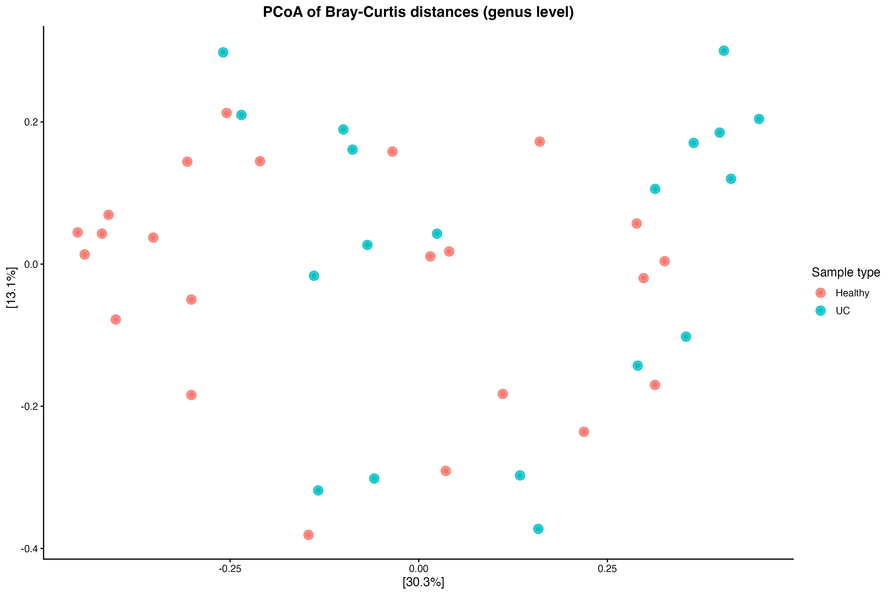

PERMANOVA with marginal effects
(<a href="#tbl-permanova" class="quarto-xref">Table 6</a>) showed that
disease status explained 9.70% of the variation (pseudo-F = 4.44, p =
0.001) after adjustment for age and gender. Age was not significantly
associated with community composition (R² = 4.11%, p = 0.071), and
neither was gender (R² = 3.57%, p = 0.104).

<table>
<thead>
<tr>
<th style="text-align: left;">Term</th>
<th style="text-align: right;">df</th>
<th style="text-align: right;">Sum of squares</th>
<th style="text-align: right;">R²</th>
<th style="text-align: right;">pseudo-F</th>
<th style="text-align: right;">p-value</th>
</tr>
</thead>
<tbody>
<tr>
<td style="text-align: left;">Disease status</td>
<td style="text-align: right;">1</td>
<td style="text-align: right;">1.0468</td>
<td style="text-align: right;">0.0970</td>
<td style="text-align: right;">4.4435</td>
<td style="text-align: right;">0.001</td>
</tr>
<tr>
<td style="text-align: left;">Age</td>
<td style="text-align: right;">1</td>
<td style="text-align: right;">0.4429</td>
<td style="text-align: right;">0.0411</td>
<td style="text-align: right;">1.8802</td>
<td style="text-align: right;">0.071</td>
</tr>
<tr>
<td style="text-align: left;">Gender</td>
<td style="text-align: right;">1</td>
<td style="text-align: right;">0.3849</td>
<td style="text-align: right;">0.0357</td>
<td style="text-align: right;">1.6336</td>
<td style="text-align: right;">0.104</td>
</tr>
<tr>
<td style="text-align: left;">Residual</td>
<td style="text-align: right;">38</td>
<td style="text-align: right;">8.9522</td>
<td style="text-align: right;">0.8297</td>
<td style="text-align: right;">—</td>
<td style="text-align: right;">—</td>
</tr>
</tbody>
</table>

Because PERMANOVA is sensitive to differences in within-group
variability, homogeneity of multivariate dispersion was tested:
dispersion did not differ significantly between groups (F = 0.936, p =
0.329; <a href="#fig-betadisper" class="quarto-xref">Figure 12</a>),
although UC samples show a visibly wider spread and the power of this
test is limited with 19 UC samples.

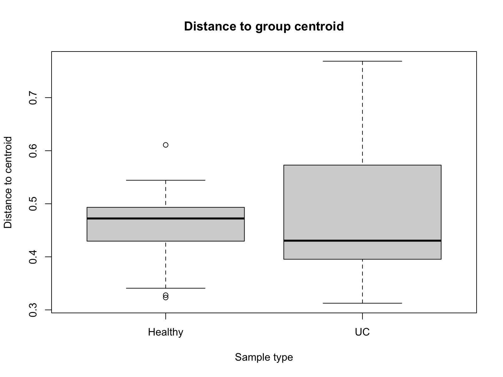

Multiple Regression on distance Matrices
(<a href="#tbl-mrm" class="quarto-xref">Table 7</a>) gives a
complementary view, modelling pairwise dissimilarities. Healthy–UC pairs
were more dissimilar than Healthy–Healthy pairs (coefficient 0.0817, p =
0.007). UC–UC pairs had a positive coefficient of similar magnitude
(0.0600) that did not reach significance (p = 0.222); with 19 UC
samples, the data therefore do not allow us to conclude whether UC
microbiomes are more heterogeneous among themselves than healthy ones.
The overall MRM model explained 4.88% of the variation in pairwise
dissimilarities and was not significant (p = 0.122), so the Healthy–UC
coefficient should be read together with the PERMANOVA result.

<table>
<thead>
<tr>
<th style="text-align: left;">Predictor (pairwise)</th>
<th style="text-align: right;">Coefficient</th>
<th style="text-align: right;">p-value</th>
</tr>
</thead>
<tbody>
<tr>
<td style="text-align: left;">Healthy–UC pair (vs Healthy–Healthy)</td>
<td style="text-align: right;">0.0817</td>
<td style="text-align: right;">0.007</td>
</tr>
<tr>
<td style="text-align: left;">UC–UC pair (vs Healthy–Healthy)</td>
<td style="text-align: right;">0.0600</td>
<td style="text-align: right;">0.222</td>
</tr>
<tr>
<td style="text-align: left;">Age difference</td>
<td style="text-align: right;">-0.0046</td>
<td style="text-align: right;">0.256</td>
</tr>
<tr>
<td style="text-align: left;">Female–Male pair (vs Male–Male)</td>
<td style="text-align: right;">0.0119</td>
<td style="text-align: right;">0.649</td>
</tr>
<tr>
<td style="text-align: left;">Female–Female pair (vs Male–Male)</td>
<td style="text-align: right;">0.0163</td>
<td style="text-align: right;">0.724</td>
</tr>
</tbody>
</table>

## Differential abundance

After aggregation at family level, 112 family-level units were
available; 75 remained after removing units with zero counts in at least
90% of samples and 59 after the variance filter. TMM normalization
factors ranged from 0.134 to 3.985; because many families have zero
counts in many samples, the log-CPM distributions are flat at the lower
end and the visible effect of normalization is modest
(<a href="#fig-tmm-before" class="quarto-xref">Figure 13</a>,
<a href="#fig-tmm-after" class="quarto-xref">Figure 14</a>). The common
dispersion estimate was 6.015 (biological coefficient of variation ≈
2.45), reflecting the strong overdispersion typical of sparse
family-level counts.

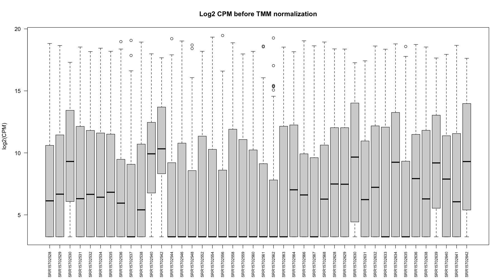

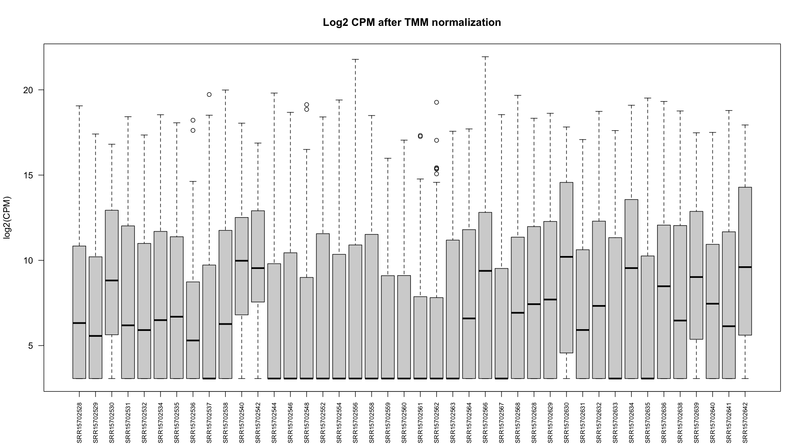

Exploratory ordinations of the normalized data (MDS and PCA; Appendix)
showed a partial separation between groups.

The exact test identified 28 taxa with BH-FDR \< 0.25: 12 enriched and
16 depleted in UC
(<a href="#fig-volcano" class="quarto-xref">Figure 15</a>,
<a href="#tbl-da" class="quarto-xref">Table 8</a>,
<a href="#fig-heatmap" class="quarto-xref">Figure 16</a>). Sixteen of
them also passed FDR \< 0.05. The strongest signals included enrichment
of Enterobacteriaceae, Morganellaceae, Neisseriaceae, Porphyromonadaceae
and Fusobacteriaceae in UC, together with depletion of
Methanobacteriaceae, Barnesiellaceae and the \[Eubacterium\]
coprostanoligenes group.

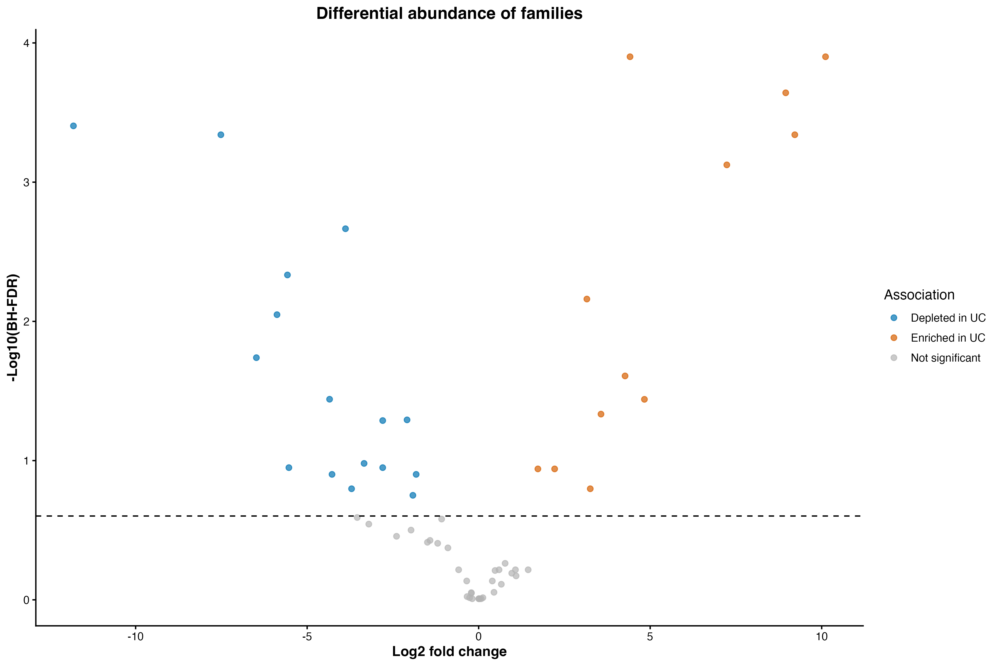

<table class="do-not-create-environment cell">
<colgroup>
<col style="width: 35%" />
<col style="width: 21%" />
<col style="width: 14%" />
<col style="width: 7%" />
<col style="width: 7%" />
<col style="width: 13%" />
</colgroup>
<thead>
<tr>
<th style="text-align: left;">Taxon</th>
<th style="text-align: right;">log2 FC (UC vs Healthy)</th>
<th style="text-align: right;">Average log2 CPM</th>
<th style="text-align: right;">p-value</th>
<th style="text-align: right;">BH-FDR</th>
<th style="text-align: left;">Direction</th>
</tr>
</thead>
<tbody>
<tr>
<td style="text-align: left;">Enterobacteriaceae</td>
<td style="text-align: right;">4.41</td>
<td style="text-align: right;">14.76</td>
<td style="text-align: right;">3.07e-06</td>
<td style="text-align: right;">0.000126</td>
<td style="text-align: left;">Enriched in UC</td>
</tr>
<tr>
<td style="text-align: left;">Morganellaceae</td>
<td style="text-align: right;">10.11</td>
<td style="text-align: right;">9.05</td>
<td style="text-align: right;">4.26e-06</td>
<td style="text-align: right;">0.000126</td>
<td style="text-align: left;">Enriched in UC</td>
</tr>
<tr>
<td style="text-align: left;">Neisseriaceae</td>
<td style="text-align: right;">8.95</td>
<td style="text-align: right;">9.46</td>
<td style="text-align: right;">1.16e-05</td>
<td style="text-align: right;">0.000228</td>
<td style="text-align: left;">Enriched in UC</td>
</tr>
<tr>
<td style="text-align: left;">Methanobacteriaceae</td>
<td style="text-align: right;">-11.81</td>
<td style="text-align: right;">11.02</td>
<td style="text-align: right;">2.67e-05</td>
<td style="text-align: right;">0.000394</td>
<td style="text-align: left;">Depleted in UC</td>
</tr>
<tr>
<td style="text-align: left;">Barnesiellaceae</td>
<td style="text-align: right;">-7.52</td>
<td style="text-align: right;">12.02</td>
<td style="text-align: right;">4.28e-05</td>
<td style="text-align: right;">0.000457</td>
<td style="text-align: left;">Depleted in UC</td>
</tr>
<tr>
<td style="text-align: left;">Porphyromonadaceae</td>
<td style="text-align: right;">9.22</td>
<td style="text-align: right;">12.17</td>
<td style="text-align: right;">4.64e-05</td>
<td style="text-align: right;">0.000457</td>
<td style="text-align: left;">Enriched in UC</td>
</tr>
<tr>
<td style="text-align: left;">Fusobacteriaceae</td>
<td style="text-align: right;">7.23</td>
<td style="text-align: right;">12.52</td>
<td style="text-align: right;">8.92e-05</td>
<td style="text-align: right;">0.000751</td>
<td style="text-align: left;">Enriched in UC</td>
</tr>
<tr>
<td style="text-align: left;">[Eubacterium] coprostanoligenes group</td>
<td style="text-align: right;">-3.88</td>
<td style="text-align: right;">11.98</td>
<td style="text-align: right;">0.000293</td>
<td style="text-align: right;">0.00216</td>
<td style="text-align: left;">Depleted in UC</td>
</tr>
<tr>
<td style="text-align: left;">Unclassified (order Chloroplast)</td>
<td style="text-align: right;">-5.57</td>
<td style="text-align: right;">6.48</td>
<td style="text-align: right;">0.000708</td>
<td style="text-align: right;">0.00464</td>
<td style="text-align: left;">Depleted in UC</td>
</tr>
<tr>
<td style="text-align: left;">Pasteurellaceae</td>
<td style="text-align: right;">3.15</td>
<td style="text-align: right;">13.07</td>
<td style="text-align: right;">0.00117</td>
<td style="text-align: right;">0.00691</td>
<td style="text-align: left;">Enriched in UC</td>
</tr>
<tr>
<td style="text-align: left;">Moraxellaceae</td>
<td style="text-align: right;">-5.88</td>
<td style="text-align: right;">5.67</td>
<td style="text-align: right;">0.00167</td>
<td style="text-align: right;">0.00895</td>
<td style="text-align: left;">Depleted in UC</td>
</tr>
<tr>
<td style="text-align: left;">Victivallaceae</td>
<td style="text-align: right;">-6.48</td>
<td style="text-align: right;">6.09</td>
<td style="text-align: right;">0.00371</td>
<td style="text-align: right;">0.0182</td>
<td style="text-align: left;">Depleted in UC</td>
</tr>
<tr>
<td style="text-align: left;">Family XI</td>
<td style="text-align: right;">4.27</td>
<td style="text-align: right;">10.18</td>
<td style="text-align: right;">0.00543</td>
<td style="text-align: right;">0.0247</td>
<td style="text-align: left;">Enriched in UC</td>
</tr>
<tr>
<td style="text-align: left;">Unclassified (order Oscillospirales)</td>
<td style="text-align: right;">-4.35</td>
<td style="text-align: right;">6.82</td>
<td style="text-align: right;">0.0086</td>
<td style="text-align: right;">0.0362</td>
<td style="text-align: left;">Depleted in UC</td>
</tr>
<tr>
<td style="text-align: left;">Unclassified (order Bacteroidales)</td>
<td style="text-align: right;">4.83</td>
<td style="text-align: right;">9.41</td>
<td style="text-align: right;">0.00923</td>
<td style="text-align: right;">0.0363</td>
<td style="text-align: left;">Enriched in UC</td>
</tr>
<tr>
<td style="text-align: left;">Campylobacteraceae</td>
<td style="text-align: right;">3.57</td>
<td style="text-align: right;">6.48</td>
<td style="text-align: right;">0.0126</td>
<td style="text-align: right;">0.0464</td>
<td style="text-align: left;">Enriched in UC</td>
</tr>
<tr>
<td style="text-align: left;">Eggerthellaceae</td>
<td style="text-align: right;">-2.09</td>
<td style="text-align: right;">11.80</td>
<td style="text-align: right;">0.0147</td>
<td style="text-align: right;">0.051</td>
<td style="text-align: left;">Depleted in UC</td>
</tr>
<tr>
<td style="text-align: left;">Monoglobaceae</td>
<td style="text-align: right;">-2.80</td>
<td style="text-align: right;">11.53</td>
<td style="text-align: right;">0.0157</td>
<td style="text-align: right;">0.0516</td>
<td style="text-align: left;">Depleted in UC</td>
</tr>
<tr>
<td style="text-align: left;">Akkermansiaceae</td>
<td style="text-align: right;">-3.34</td>
<td style="text-align: right;">14.07</td>
<td style="text-align: right;">0.0337</td>
<td style="text-align: right;">0.105</td>
<td style="text-align: left;">Depleted in UC</td>
</tr>
<tr>
<td style="text-align: left;">Pseudomonadaceae</td>
<td style="text-align: right;">-2.80</td>
<td style="text-align: right;">6.62</td>
<td style="text-align: right;">0.0389</td>
<td style="text-align: right;">0.112</td>
<td style="text-align: left;">Depleted in UC</td>
</tr>
<tr>
<td style="text-align: left;">Unclassified (order RF39)</td>
<td style="text-align: right;">-5.53</td>
<td style="text-align: right;">12.29</td>
<td style="text-align: right;">0.04</td>
<td style="text-align: right;">0.112</td>
<td style="text-align: left;">Depleted in UC</td>
</tr>
<tr>
<td style="text-align: left;">Bacteroidaceae</td>
<td style="text-align: right;">1.73</td>
<td style="text-align: right;">18.56</td>
<td style="text-align: right;">0.0441</td>
<td style="text-align: right;">0.115</td>
<td style="text-align: left;">Enriched in UC</td>
</tr>
<tr>
<td style="text-align: left;">Sutterellaceae</td>
<td style="text-align: right;">2.21</td>
<td style="text-align: right;">14.25</td>
<td style="text-align: right;">0.0447</td>
<td style="text-align: right;">0.115</td>
<td style="text-align: left;">Enriched in UC</td>
</tr>
<tr>
<td style="text-align: left;">Unclassified (order Clostridia
UCG-014)</td>
<td style="text-align: right;">-4.27</td>
<td style="text-align: right;">13.19</td>
<td style="text-align: right;">0.0515</td>
<td style="text-align: right;">0.126</td>
<td style="text-align: left;">Depleted in UC</td>
</tr>
<tr>
<td style="text-align: left;">Clostridiaceae</td>
<td style="text-align: right;">-1.82</td>
<td style="text-align: right;">13.69</td>
<td style="text-align: right;">0.0532</td>
<td style="text-align: right;">0.126</td>
<td style="text-align: left;">Depleted in UC</td>
</tr>
<tr>
<td style="text-align: left;">UCG-010</td>
<td style="text-align: right;">-3.70</td>
<td style="text-align: right;">9.53</td>
<td style="text-align: right;">0.0719</td>
<td style="text-align: right;">0.159</td>
<td style="text-align: left;">Depleted in UC</td>
</tr>
<tr>
<td style="text-align: left;">Carnobacteriaceae</td>
<td style="text-align: right;">3.25</td>
<td style="text-align: right;">8.81</td>
<td style="text-align: right;">0.0729</td>
<td style="text-align: right;">0.159</td>
<td style="text-align: left;">Enriched in UC</td>
</tr>
<tr>
<td style="text-align: left;">Unclassified (class Clostridia)</td>
<td style="text-align: right;">-1.92</td>
<td style="text-align: right;">7.93</td>
<td style="text-align: right;">0.0842</td>
<td style="text-align: right;">0.178</td>
<td style="text-align: left;">Depleted in UC</td>
</tr>
</tbody>
</table>

Of the 28 taxa, 22 are named families and 6 are unclassified lineages
(one enriched, annotated at order Bacteroidales; five depleted,
annotated at order Chloroplast, Oscillospirales, RF39, Clostridia
UCG-014 and class Clostridia), which cannot be interpreted at family
level. Two further points call for caution. The order Chloroplast
comprises plant-derived organelle sequences, likely of dietary origin,
which were not removed before the analysis; and Methanobacteriaceae is
an archaeal family amplified by the same primers, so not all depleted
taxa are bacterial. Moreover, several of the strongest signals reflect
presence/absence patterns visible in the heatmap
(<a href="#fig-heatmap" class="quarto-xref">Figure 16</a>):
Morganellaceae and Neisseriaceae are detected mainly in a subset of UC
samples, and Methanobacteriaceae only in a subset of healthy samples.
Log2 fold changes of this size (up to about 10) derive from these
patterns and should be interpreted with caution.

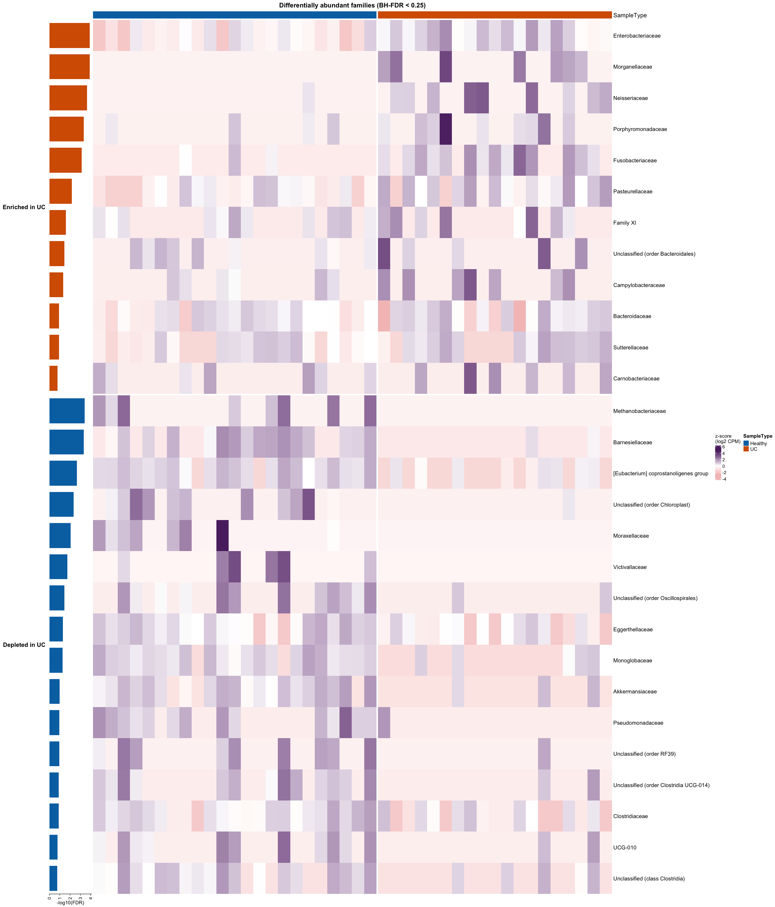

# Discussion

## Interpretation

The present analysis indicates an alteration of the gut microbiome in
children with UC compared with healthy controls. Alpha diversity was
significantly lower in UC, with a median Shannon index of 2.44 compared
with 2.69 in healthy children (Wilcoxon p = 0.002). This difference
remained evident after adjustment for age and gender, with UC associated
with an approximately 20% lower Shannon diversity (fold change 0.80, 95%
CI 0.71–0.90, p \< 0.001). At the community-composition level, disease
status explained 9.7% of the variation in genus-level Bray–Curtis
dissimilarities (PERMANOVA pseudo-F = 4.44, p = 0.001), whereas age and
gender did not reach conventional statistical significance. Multivariate
dispersion did not differ significantly between groups (F = 0.94, p =
0.329), which suggests that the PERMANOVA signal mainly reflects
differences in community centroids, although the power of the dispersion
test is limited.

The taxonomic profiles were consistent with this broader shift in
community structure. Healthy samples were dominated by Bacillota and
Bacteroidota, whereas UC samples showed a lower relative abundance of
Bacillota and higher Bacteroidota and Pseudomonadota.
Differential-abundance analysis further identified 28 taxa at BH-FDR \<
0.25 (22 named families and 6 unclassified lineages), including 12
enriched and 16 depleted in UC, with 16 passing the more stringent FDR
\< 0.05 threshold. Among the strongest signals, Enterobacteriaceae,
Morganellaceae and Neisseriaceae were enriched in UC, whereas
Methanobacteriaceae, Barnesiellaceae and the \[Eubacterium\]
coprostanoligenes group were depleted. The expansion of
Enterobacteriaceae-related taxa is consistent with the well-described
association between intestinal inflammation and facultative anaerobic
Proteobacteria (Pseudomonadota), whereas depletion of taxa belonging to
anaerobic and potentially metabolically beneficial groups may reflect
disruption of the healthy intestinal microbial ecosystem. These
taxonomic changes should nevertheless be interpreted as associations
rather than evidence of causality.

Taken together, the alpha-diversity, beta-diversity and
differential-abundance results are consistent with UC-associated
microbiome dysbiosis. The lower Shannon diversity indicates reduced
within-sample community complexity, while PERMANOVA indicates that UC
status is also associated with a shift in overall community composition.
Differential-abundance analysis identifies specific taxonomic features
that accompany this separation, including expansion of
Enterobacteriaceae-related taxa and depletion of several anaerobic taxa.

## Comparison with the original study

Zuo et al. (2022) reported that pediatric UC was characterized by a
dysbiotic and less diverse gut microbial population, with some species
of the Christensenellaceae family depleted and some species of the
Enterobacteriaceae family enriched, and reported broadly similar
findings between 16S rRNA and shotgun metagenomic data for alpha
diversity, beta diversity and prediction accuracy. In the present
analysis, alpha diversity was concordant with these findings, with
significantly lower Shannon diversity in UC, and community composition
was also concordant, with disease status significantly associated with
genus-level Bray–Curtis community structure. Enterobacteriaceae were
among the differentially abundant families in the present analysis and
were strongly enriched in UC (log2 fold change = 4.41, BH-FDR = 1.26 ×
10⁻⁴). In contrast, Christensenellaceae were not differentially abundant
in the present analysis (P = 0.229, BH-FDR = 0.386), and therefore the
reported Christensenellaceae depletion could not be reproduced at the
family level in this analysis.

Differences between the studies are expected because the present
analysis tested differential abundance at the family level, whereas Zuo
et al. also resolved taxonomic differences at the species level. In
addition, the analytical frameworks differed, including TMM
normalization and the edgeR exact test used here, as well as differences
in feature filtering and potentially in the reference taxonomy.
Consequently, absence of a significant Christensenellaceae signal in the
present family-level analysis does not necessarily contradict
species-level depletion reported by Zuo et al.; species-specific changes
can be obscured when taxa are aggregated to a higher taxonomic level.

## Limitations

-   **Sample size.** With 42 children, power is limited, in particular
    for the family-level tests, where an FDR threshold of 0.25 was used.
    Results should be considered exploratory and in need of validation.
-   **Cross-sectional design and confounding.** The data come from a
    single time point. Age and gender were accounted for in alpha and
    beta diversity, but not in the differential abundance test, which
    compares two groups only. Treatment-related variables available in
    the metadata (antibiotics, biologics, steroids, aminosalicylates,
    immunomodulators) were not modelled and may influence the UC
    microbiome.
-   **Compositionality.** 16S data are relative. Differences in the
    abundance of one family can reflect changes in other families; TMM
    normalization mitigates but does not remove this limitation, and
    results are interpreted as differences in observed relative
    abundance, not absolute abundance.
-   **Sparse signals.** Several differentially abundant taxa are
    detected in only a subset of samples of one group and absent in the
    other; the corresponding fold changes are large but statistically
    fragile.
-   **Non-bacterial and non-microbial sequences.** Plant organelle
    (chloroplast) sequences were not filtered out, and the primers also
    amplify archaea; one significant taxon belongs to each category.
-   **Resolution of the V4 region.** Taxonomic assignment is reliable
    mainly to genus level; species-level calls are exact matches and
    should be interpreted with caution.
-   **Taxonomic aggregation.** ASVs without annotation at the chosen
    rank are retained as separate unclassified units (6 of the 28
    significant taxa), and the unclassified fraction (32.21% of ASVs at
    genus level) cannot be interpreted biologically.
-   **Distance choice.** Beta diversity was based on Bray-Curtis
    dissimilarities of relative abundances; phylogeny-based metrics
    (UniFrac) and compositional distances (Aitchison) were not used.

## Possible extensions

-   Removal of chloroplast and mitochondrial sequences, and separate
    handling of archaea, before the diversity and differential-abundance
    analyses.
-   Differential abundance with covariate adjustment (age, gender,
    treatment), for example an edgeR generalized linear model or a
    compositional method, as a sensitivity analysis.
-   Genus-level differential abundance for a more direct comparison with
    the original study.
-   Phylogenetic tree construction and UniFrac distances.
-   Integration with the shotgun metagenomic data of the same cohort.

# Conclusions

-   **Alpha diversity:** UC children showed significantly lower
    genus-level Shannon diversity than healthy children, with the
    difference remaining significant after adjustment for age, gender
    and sequencing depth, and at every rarefaction depth tested.
-   **Community composition:** UC was associated with a distinct
    genus-level community composition, explaining approximately 9.7% of
    Bray–Curtis variation after accounting for age and gender;
    dispersion did not differ significantly between groups.
-   **Differential abundance:** family-level analysis identified 28
    differentially abundant taxa (22 named families and 6 unclassified
    lineages) at BH-FDR \< 0.25, 12 enriched and 16 depleted in UC; 16
    also met the more stringent FDR \< 0.05 threshold.
    Enterobacteriaceae-related taxa were among the strongest UC-enriched
    signals, whereas Methanobacteriaceae and Barnesiellaceae were among
    the strongest depleted taxa.
-   **Overall microbiome profile:** taken together, the results support
    a less diverse and compositionally distinct gut microbiome in
    pediatric UC. The findings are exploratory and should be validated
    in larger, independent cohorts with more comprehensive adjustment
    for treatment and other clinical confounders.

# Reproducibility

The analysis is fully scripted and organized in six modules
(`download_16S_fastq.sh`, `qc.sh`, `01_dada2.r`,
`02_phyloseq_beta_diversity.r`, `03_phyloseq_alpha_diversity.r`,
`04_differential_abundance_analysis.r`). The R environment is managed
with `renv`, random seeds are fixed, and the session information of each
script is saved in the log directory. Instructions to rerun the analysis
are in the repository README.

# References

-   Zuo W, Wang B, Bai X, et al. (2022). 16S rRNA and metagenomic
    shotgun sequencing data revealed consistent patterns of gut
    microbiome signature in pediatric ulcerative colitis. *Scientific
    Reports*. DOI: 10.1038/s41598-022-07995-7.
-   Callahan BJ, McMurdie PJ, Rosen MJ, et al. (2016). DADA2:
    High-resolution sample inference from Illumina amplicon data.
    *Nature Methods*, 13:581–583.
-   Quast C, Pruesse E, Yilmaz P, et al. (2013). The SILVA ribosomal RNA
    gene database project. *Nucleic Acids Research*, 41:D590–D596.
-   McMurdie PJ, Holmes S. (2013). phyloseq: An R package for
    reproducible interactive analysis and graphics of microbiome census
    data. *PLoS ONE*, 8:e61217.
-   McMurdie PJ, Holmes S. (2014). Waste not, want not: why rarefying
    microbiome data is inadmissible. *PLoS Computational Biology*,
    10:e1003531.
-   Anderson MJ. (2001). A new method for non-parametric multivariate
    analysis of variance. *Austral Ecology*, 26:32–46.
-   Lichstein JW. (2007). Multiple regression on distance matrices: a
    multivariate spatial analysis tool. *Plant Ecology*, 188:117–131.
-   Robinson MD, McCarthy DJ, Smyth GK. (2010). edgeR: a Bioconductor
    package for differential expression analysis of digital gene
    expression data. *Bioinformatics*, 26:139–140.
-   Robinson MD, Oshlack A. (2010). A scaling normalization method for
    differential expression analysis of RNA-seq data. *Genome Biology*,
    11:R25.
-   Gloor GB, Macklaim JM, Pawlowsky-Glahn V, Egozcue JJ. (2017).
    Microbiome datasets are compositional: and this is not optional.
    *Frontiers in Microbiology*, 8:2224.

# Appendix

## Supplementary figures

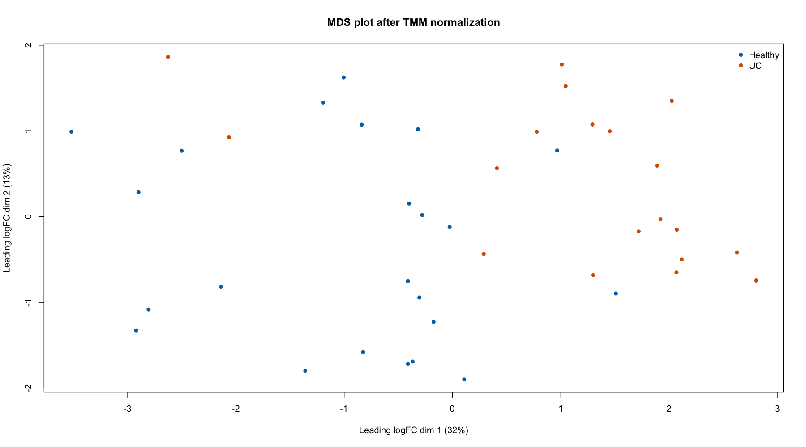

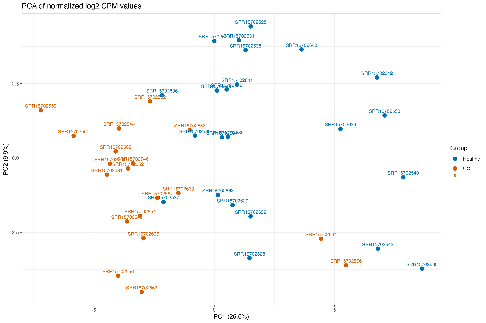

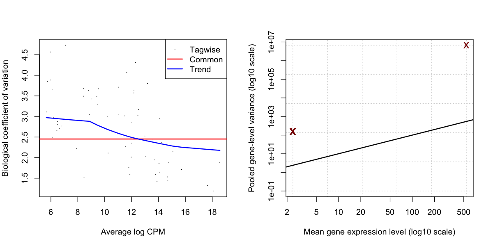

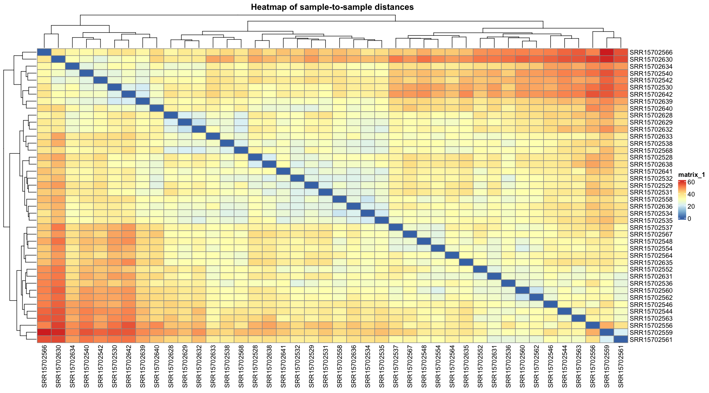

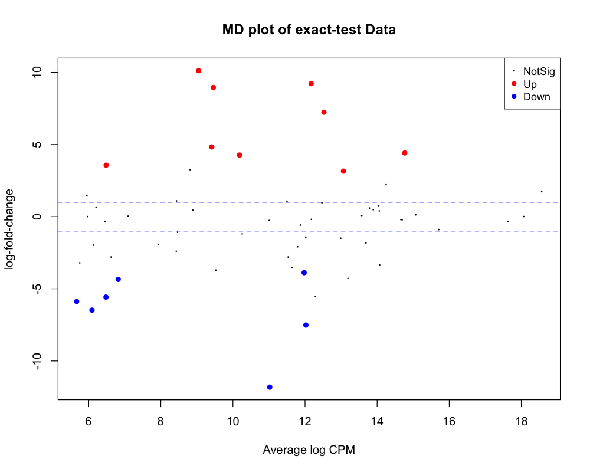

## Main analysis parameters

<table>
<caption>Main parameters used in the analysis.</caption>
<colgroup>
<col style="width: 27%" />
<col style="width: 38%" />
<col style="width: 33%" />
</colgroup>
<thead>
<tr>
<th style="text-align: left;">Step</th>
<th style="text-align: left;">Parameter</th>
<th style="text-align: left;">Value</th>
</tr>
</thead>
<tbody>
<tr>
<td style="text-align: left;">Filtering</td>
<td style="text-align: left;">Truncation lengths (F/R)</td>
<td style="text-align: left;">140 / 130 bp</td>
</tr>
<tr>
<td style="text-align: left;">Filtering</td>
<td style="text-align: left;">Maximum expected errors (F/R)</td>
<td style="text-align: left;">2 / 2</td>
</tr>
<tr>
<td style="text-align: left;">Filtering</td>
<td style="text-align: left;">Ambiguous bases</td>
<td style="text-align: left;">0</td>
</tr>
<tr>
<td style="text-align: left;">Chimera removal</td>
<td style="text-align: left;">Method</td>
<td style="text-align: left;">consensus</td>
</tr>
<tr>
<td style="text-align: left;">Taxonomy</td>
<td style="text-align: left;">Reference</td>
<td style="text-align: left;">SILVA 138.2 (nr99 training set + species
file)</td>
</tr>
<tr>
<td style="text-align: left;">Alpha diversity</td>
<td style="text-align: left;">Index / level</td>
<td style="text-align: left;">Shannon / genus</td>
</tr>
<tr>
<td style="text-align: left;">Rarefaction</td>
<td style="text-align: left;">Depths, repetitions</td>
<td style="text-align: left;">1K, 5K, 10K, 30K, 50K, 100K; 100</td>
</tr>
<tr>
<td style="text-align: left;">Beta diversity</td>
<td style="text-align: left;">Distance / level</td>
<td style="text-align: left;">Bray-Curtis / genus</td>
</tr>
<tr>
<td style="text-align: left;">PERMANOVA, betadisper, MRM</td>
<td style="text-align: left;">Permutations, seed</td>
<td style="text-align: left;">999, 1234</td>
</tr>
<tr>
<td style="text-align: left;">Differential abundance</td>
<td style="text-align: left;">Level / normalization / test</td>
<td style="text-align: left;">family / TMM / exact test</td>
</tr>
<tr>
<td style="text-align: left;">Differential abundance</td>
<td style="text-align: left;">Filters</td>
<td style="text-align: left;">zero counts &lt; 90% of samples; variance
≥ 0.5 × median</td>
</tr>
<tr>
<td style="text-align: left;">Differential abundance</td>
<td style="text-align: left;">Significance</td>
<td style="text-align: left;">BH-FDR &lt; 0.25</td>
</tr>
</tbody>
</table>

## Software environment

R v4.6.0. The exact versions of all R packages are recorded in
`renv.lock`, and the session information of each analysis script is
saved in the log directory of the repository.
